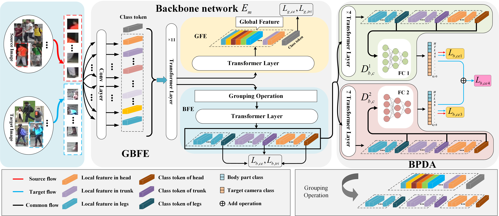

# Body Part-level Domain Alignment for Domain-adaptive Person Re-identification with Transformer Framework[[TIFS]](https://ieeexplore.ieee.org/abstract/document/9895288)

Pytorch Implementation of our paper [Body Part-level Domain Alignment for Domain-adaptive Person Re-identification with Transformer Framework](https://ieeexplore.ieee.org/abstract/document/9895288) accepted by **IEEE Transactions on Information Forensics and Security**. 

## Framework of our method



## Usage

- This project is based on TransReID[1] ([paper](https://openaccess.thecvf.com/content/ICCV2021/papers/He_TransReID_Transformer-Based_Object_Re-Identification_ICCV_2021_paper.pdf) and [official code](https://github.com/heshuting555/TransReID))
- Usage of this code is free for research purposes only. 

## Requirements
- python = 3.9
- torch = 1.7.1
- torchvision = 0.8.2
- opencv-python = 4.5.1.48
- timm = 0.4.5
- yacs = 0.1.8


###  
```bash
we use a single NVIDIA GeForce RTX2080TI GPU(CUDA 10.1) for training and evaluation.
```

### Prepare Datasets

```bash
mkdir data
```
Download the person datasets **Market1501**,**DukeMTMC-reID**.

you can find the **Duke-new**,**Market1501-new**,**MSMT17-new** in [[DRDL]](https://github.com/lhf12278/DRDL) [2], 
and **Duke-SCT**,**Market1501-SCT** in [[SCT-ReID]](https://github.com/FlyHighest/Single-Camera-Training-ReID) [3].


Make new directories in data and organize them as follows:

```
data
├── market1501
│       └── bounding_box_train
│       └── bounding_box_train_s
│       └── bounding_box_train_sct
│       └── bounding_box_test
│       └── query

├── dukemtmcreid
│   └── DukeMTMC-reID 
│       └── bounding_box_train
│       └── bounding_box_train_s
│       └── bounding_box_train_sct
│       └── bounding_box_test
│       └── query

├── MSMT17
│   └── test
│   └── train
│   └── list_gallery.txt
│   └── list_query.txt
│   └── list_train.txt
│   └── list_val.txt
```
Tips:

**Duke:**

the file "bounding_box_train_s" is the training set for duke-new and market-new


**Market:**

the file "bounding_box_train_sct" is the training set for duke-SCT and market-SCT

When use different protocol dataset for train, please change the train_dir in dataset files:

Duke:

dukemtmcreid.py
```
    self.train_dir = osp.join(self.dataset_dir, 'DukeMTMC-reID/bounding_box_train')
  # self.train_dir = osp.join(self.dataset_dir, 'DukeMTMC-reID/bounding_box_train_s') 
  # self.train_dir = osp.join(self.dataset_dir, 'DukeMTMC-reID/bounding_box_train_sct')
```

Market:

market1501.py
```
    self.train_dir = osp.join(self.dataset_dir, 'bounding_box_train')
  # self.train_dir = osp.join(self.dataset_dir, 'bounding_box_train_s') 
  # self.train_dir = osp.join(self.dataset_dir, 'bounding_box_train_sct')
```

### Training
- 1.Replace dataset path with your own path in vit_3_domain.yml
```
DATASETS:
  NAMES: ('') # source data
  TARGET: ('') # target data
  ROOT_DIR: ('')
```    
- 2.Begin the training
```
  python train.py
```

### Test
- 1.Replace test file path with your own path in vit_3_domain.yml
```
TEST:
  WEIGHT: '*.pth'
```  
- 2.Replace dataset path with your own path in vit_3_domain.yml

```
# keep the source & target data are same as the *.pth
DATASETS:
  NAMES: ('') # source data
  TARGET: ('') # target data
  ROOT_DIR: ('')
```    

-  3.Change the num_class in test.py
```
      # Duke source num_class = 702
      # Market source num_class = 751
      model, _, _ = make_model(cfg, num_class=702, num_class_t=c_pids, camera_num=camera_num, view_num=view_num)
```

- 4.Begin the test
```
  python test.py
```
## Citation

Please cite this paper if it helps your research:

```
@ARTICLE{BPDA2022,
  author={Wang, Yiming and Qi, Guanqiu and Li, Shuang and Chai, Yi and Li, Huafeng},
  journal={IEEE Transactions on Information Forensics and Security}, 
  title={Body Part-Level Domain Alignment for Domain-Adaptive Person Re-Identification With Transformer Framework}, 
  year={2022},
  volume={17},
  pages={3321-3334}}
```

## Contact

If you have any question, please feel free to contact us. E-mail: [shuangli936@gmail.com](mailto:shuangli936@gmail.com)

## Reference
```
[1]S He, H Luo, P Wang, et al. Transreid: Transformer-based object re-identification[C]//Proceedings of the IEEE/CVF international conference on computer vision. 2021: 15013-15022.
[2]HF Li, KX X, JX Li, et al. Dual-stream Reciprocal Disentanglement Learning for domain adaptation person re-identification[J]//Knowledge-Based Systems. 2022, 251: 109315.
[3]TY Zhang, LX Xie, LH Wei, et al. Single Camera Training for Person Re-Identification[C]. The AAAI Conference on Artificial Intelligence (AAAI). 2020, 34(7): 12878-12885.
```


## Pretrain & load Model Loading
BaiduYun:[[url]](https://pan.baidu.com/s/1V-wQMvOmUoyFeUS--IjP6w) 

Load code：fcbm